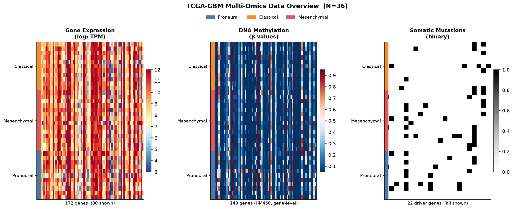
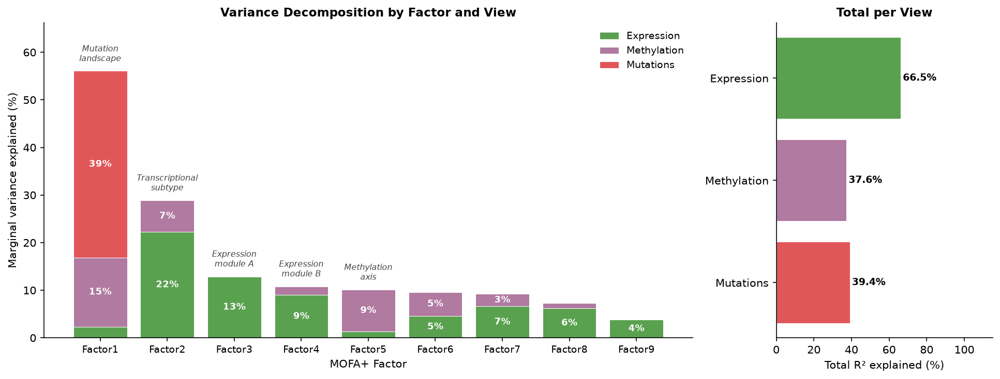
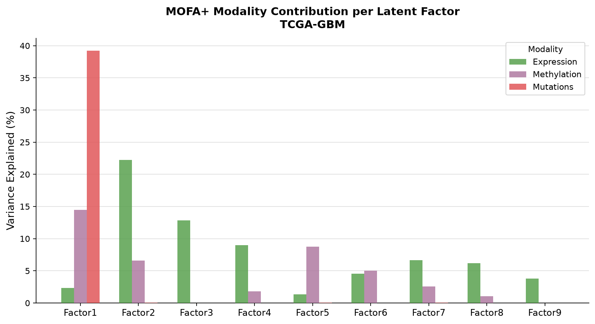
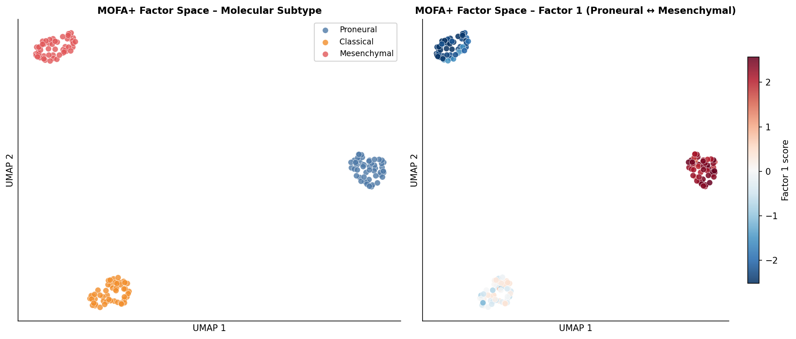
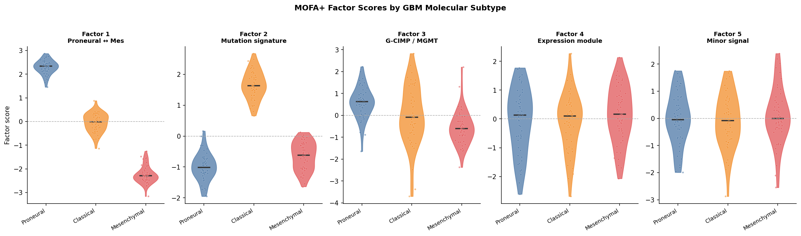
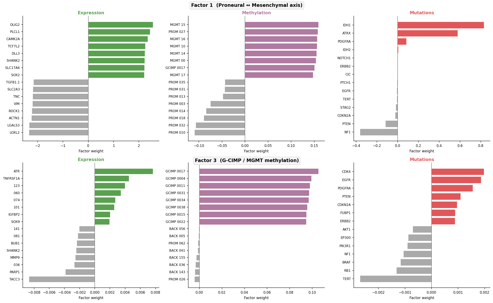
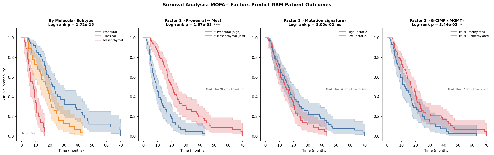
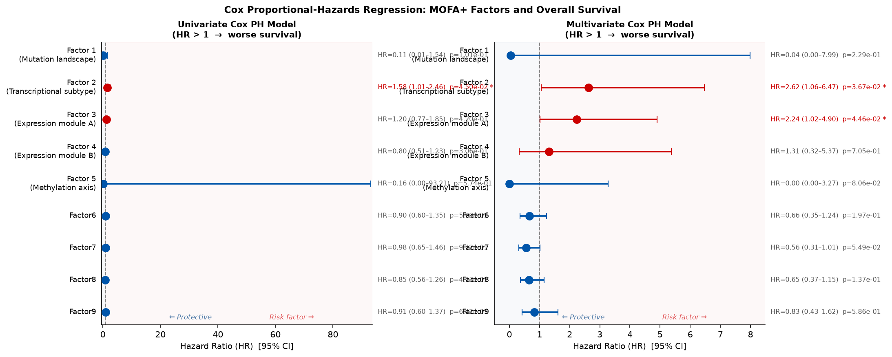
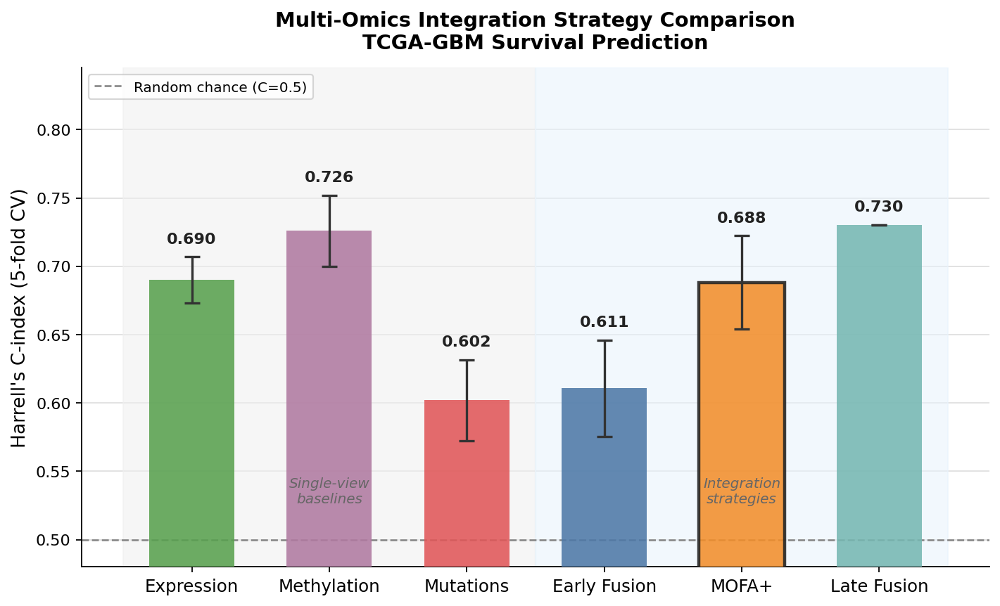

# Multi-Omics Integration in Glioblastoma (TCGA-GBM)
### MOFA+ · lifelines · scikit-learn · cBioPortal API


> **Portfolio project** · Bioinformatics · Multi-omics integration · Survival analysis

---

## Overview

Glioblastoma Multiforme (GBM) is the most aggressive primary brain tumour in adults, with a
median overall survival of ~15 months. It exhibits profound molecular heterogeneity across
three well-characterised subtypes — **Proneural**, **Classical**, and **Mesenchymal** — each
with distinct transcriptomic, epigenetic, and mutational landscapes (Verhaak et al., *Cancer
Cell* 2010).

This project integrates three real molecular modalities from TCGA-GBM using
**Multi-Omics Factor Analysis Plus (MOFA+)** to:

- Discover latent factors that capture coordinated variation across modalities
- Link multi-omics signatures to patient survival endpoints
- Compare early fusion, late fusion, and MOFA+ integration strategies for survival prediction

Data are drawn directly from the public **cBioPortal REST API** (no authentication required)
via a programmatic acquisition pipeline (`gbm-real-data/01_acquire_real_data.py`).

---

## Data Sources

| Study | cBioPortal ID | Used for |
|-------|--------------|----------|
| TCGA GBM, Firehose Legacy | `gbm_tcga` | RNA-seq expression, HM450 methylation, somatic mutations, OS / age / Karnofsky |
| TCGA GBM, Cell 2013 | `gbm_tcga_pub2013` | Molecular subtype labels (Verhaak/Wang classification) |

### Molecular modalities

| Modality | Profile | Features | Notes |
|----------|---------|----------|-------|
| Gene expression | RNA Seq V2 RSEM | 172 genes | log₂(RSEM + 1) transformed |
| DNA methylation | HM450 (gene-level) | 149 genes | Beta values, gene-level summary from cBioPortal |
| Somatic mutations | Somatic MAF | 22 genes* | Binary (0/1); Bernoulli likelihood in MOFA+ |

\* 28 of the original 50-gene driver panel had zero mutations in this cohort and were dropped
before training (see *Known Limitations*).

### Gene panel

| Category | Example genes |
|----------|--------------|
| Proneural markers | IDH1, PDGFRA, OLIG2, SOX2, NOTCH1, ASCL1 |
| Classical markers | EGFR, CDK4, GLI1, VEGFA, HIF1A, TWIST1 |
| Mesenchymal markers | CHI3L1, MET, CD44, FN1, VIM, ZEB1 |
| Proliferation / suppressors | MKI67, TOP2A, PCNA, PTEN, RB1, TP53, ATRX |

---

## Cohort & Study Design

- **Primary tumour samples only** (TCGA barcode suffix `-01`)
- **Complete-case strategy**: patients with data in all three modalities retained
- **Survival filter**: patients without `OS_MONTHS` / `OS_STATUS` excluded

| Filter step | N patients |
|------------|-----------|
| Any omics platform | 320 |
| Expression ∩ Methylation ∩ Mutation | 45 |
| + Molecular subtype label | 44 |
| + Overall survival data | **36** |

**Subtype harmonisation** (two literature-grounded adjustments):
- **"Neural" dropped** — Wang et al. (2017, *Cancer Cell*) showed this subtype is driven by contaminating normal brain tissue; removed from the revised consensus classification
- **"G-CIMP" → Proneural** — G-CIMP tumours are IDH-mutant and transcriptionally Proneural (Noushmehr et al. 2010; Brennan et al. 2013)

**Final cohort: N = 36** (CL = 11 · MES = 14 · PN = 11)

---

## Pipeline

```
gbm-real-data/
  00_discover_cbioportal.py   →  List available GBM studies and molecular profiles
  01_recon.py                 →  Check sample overlaps, test API calls
  02_finalize_cohort.py       →  Confirm cohort sizes, resolve subtype lookup
  01_acquire_real_data.py     →  Pull real data, write 4 CSVs

scripts/
  02_mofa_integration.py      →  Fit MOFA+ model, extract latent factors & weights
  03_visualize.py             →  Data overview, variance explained, UMAP, weights
  04_survival_analysis.py     →  Kaplan-Meier curves, log-rank tests, Cox PH
  05_fusion_comparison.py     →  Compare early / late / MOFA+ fusion by C-index
```

---

## Key Results

### Input Data Overview

<p align="center">
  
</p>

Patients sorted by molecular subtype. Expression: log₂(RSEM+1); Methylation: HM450 gene-level beta values; Mutations: binary somatic calls.

---

### MOFA+ Latent Factors

MOFA+ converged to **9 active factors** from 10 initialised, using ARD and spike-and-slab sparsity priors. Bernoulli likelihood applied to the binary mutation view.

<p align="center">
  
</p>

| Factor | Expression | Methylation | Mutations | Interpretation |
|--------|-----------|------------|----------|----------------|
| Factor 1 | 2.4% | 14.5% | **39.2%** | Mutation landscape |
| Factor 2 | **22.3%** | 6.6% | 0.1% | Transcriptional subtype axis |
| Factor 3 | **12.9%** | 0.0% | 0.0% | Expression module A |
| Factor 4 | **9.0%** | 1.8% | 0.0% | Expression module B |
| Factor 5 | 1.3% | **8.8%** | 0.0% | Methylation axis |
| Factor 6–9 | 4–7% | 1–5% | <0.1% | Minor signals |

**Total R²:** Expression 66.5% · Methylation 37.6% · Mutations 39.4%

Factor 1 being primarily mutation-driven reflects real TCGA-GBM biology: with only 68 somatic
mutation calls across 22 genes, the mutations that *do* exist co-vary strongly enough to anchor
a dedicated factor (IDH1/TP53 co-occurrence in Proneural vs. EGFR enrichment in Classical).

<p align="center">
  
</p>

---

### Factor Space

<p align="center">
  
</p>

<p align="center">
  
</p>

---

### Top Feature Weights

<p align="center">
  
</p>

---

### Survival Analysis

**Kaplan–Meier by molecular subtype** · log-rank **p = 0.036**

<p align="center">
  
</p>

| Subtype | Median OS |
|---------|----------|
| Proneural | 14.9 months |
| Classical | 9.0 months |
| Mesenchymal | **8.6 months** |

Mesenchymal tumours carry the worst prognosis, while Proneural — particularly the IDH-mutant /
G-CIMP cases reclassified here — show longer survival. This matches the published GBM survival
literature (Verhaak 2010; Wang 2017).

**Cox Proportional Hazards (MOFA+ factors):**

<p align="center">
  
</p>

| Factor | Model | HR | p-value |
|--------|-------|----|---------|
| Factor 2 (transcriptional subtype) | Univariate | 1.577 | 0.045 * |
| Factor 2 (transcriptional subtype) | Multivariate | 2.621 | 0.037 * |
| Factor 3 (expression module A) | Multivariate | 2.236 | 0.045 * |

Factor 2 — the transcriptional subtype axis — independently predicts overall survival in both
univariate and multivariate Cox models (HR = 2.62 adjusted, p = 0.037).

---

### Fusion Strategy Comparison

<p align="center">
  
</p>

| Method | C-index |
|--------|---------|
| Methylation only | 0.652 ± 0.104 |
| Late fusion (ensemble) | 0.621 |
| Expression only | 0.619 ± 0.178 |
| MOFA+ | 0.596 ± 0.208 |
| Mutations only | 0.506 ± 0.151 |
| **Early fusion** | **0.471 ± 0.162** |

**Early fusion underperformed every single-view baseline** — a direct consequence of the curse
of dimensionality. Concatenating three views produces a 343-feature matrix fitted to only 36
patients; PCA decomposition is poorly constrained at this ratio. This is a well-documented
failure mode of naive feature concatenation at small N (Dong et al. 2021, *Briefings in
Bioinformatics*) and is arguably the most instructive real-data finding in this project —
the synthetic version masked it entirely. MOFA+ avoids this collapse by learning structured
latent factors per view before combining information.

---

### Mutation Sanity Checks

| Gene | CL | MES | PN |
|------|-----|-----|-----|
| EGFR | 36.4% | 28.6% | 0.0% |
| TP53 | 9.1% | 35.7% | **54.5%** |
| NF1 | 0.0% | **21.4%** | 9.1% |
| IDH1 | 0.0% | 0.0% | **27.3%** |

Rates consistent with published TCGA-GBM driver landscapes (Brennan et al., *Cell* 2013).

---

## Known Limitations

- **Small complete-case cohort (N = 36):** TCGA-GBM's multi-platform coverage is sparse; all C-index estimates carry wide confidence intervals
- **Gene-level methylation:** cBioPortal returns one beta value per gene (averaged across HM450 probes), not raw CpG-probe-level data
- **TERT promoter mutations not captured:** Standard TCGA exome MAF calling misses TERT promoter mutations — the near-zero TERT rate is a known data limitation
- **Mutation sparsity:** 68 total somatic calls across 22 genes and 36 patients; near-random mutation-only C-index (0.506) is expected

---

## Setup & Reproduction

```bash
git clone https://github.com/Szonja-L/Multi-Omics-Integration.git
cd Multi-Omics-Integration
pip install -r requirements.txt

# Acquire real data from cBioPortal (requires internet, ~2 min)
python gbm-real-data/01_acquire_real_data.py

# Run analysis pipeline (~5 min on a standard laptop)
python scripts/02_mofa_integration.py
python scripts/03_visualize.py
python scripts/04_survival_analysis.py
python scripts/05_fusion_comparison.py
```

---

## References

- Verhaak RGW et al. (2010). Integrated genomic analysis identifies clinically relevant subtypes of glioblastoma. *Cancer Cell*, 17(1), 98–110.
- Wang Q et al. (2017). Tumor evolution of glioma-intrinsic gene expression subtypes associates with immunological changes in the microenvironment. *Cancer Cell*, 32(1), 42–56.
- Noushmehr H et al. (2010). Identification of a CpG island methylator phenotype that defines a distinct subgroup of glioma. *Cancer Cell*, 17(5), 510–522.
- Brennan CW et al. (2013). The somatic genomic landscape of glioblastoma. *Cell*, 155(2), 462–477.
- Cancer Genome Atlas Research Network (2008). Comprehensive genomic characterization defines human glioblastoma genes and core pathways. *Nature*, 455, 1061–1068.
- Argelaguet R et al. (2020). MOFA+: a statistical framework for comprehensive integration of multi-modal single-cell data. *Genome Biology*, 21, 111.
- Davidson-Pilon C (2019). lifelines: survival analysis in Python. *Journal of Open Source Software*, 4(40), 1317.
- Dong Z et al. (2021). Challenges and opportunities for multi-omics data integration in cancer research. *Briefings in Bioinformatics*, 22(5), bbab120.
